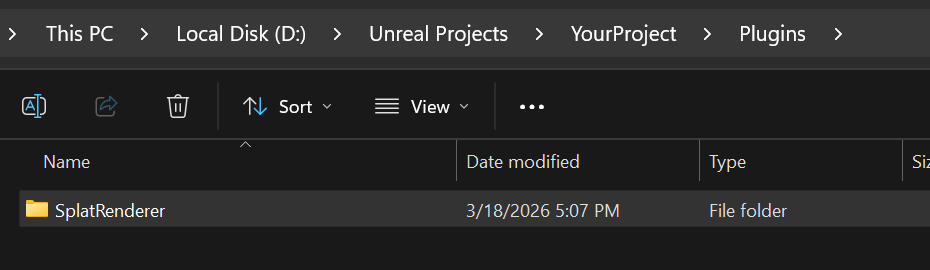

  
  <h1 align="center">Splat Renderer</h1>
  
3D/4D Gaussian Splatting renderer plugin for Unreal Engine 5.5+

  

    
    
    
    
  

  
   
  <a href="https://youtu.be/eeR5QMQA7co"><b>Watch Full Demo on YouTube</b></a>

---

## Table of Contents

- [Features](#features)
- [Getting Started](#getting-started)
- [Support](#support)
- [License](#license)

---

## Features

- **3DGS** — Real-time rendering of static Gaussian Splats from `.ply` files
- **4DGS** — Playback of 4D Gaussian Splat sequences (`.gsd` format)
- **Crop Volume** — 3D crop box with draggable editor widget
- **Rendering Controls** — Brightness, splat scale
- **Audio** — WAV playback synced to sequence

---

## Getting Started

### 1. Download

Download the latest release from the [**Releases**](https://github.com/DazaiStudio/SplatRenderer-UEPlugin/releases) page.

Extract `SplatRenderer` into your project's `Plugins/` directory.

### 2. Open Your Project

Launch your project in Unreal Engine. The plugin will be loaded automatically.

Verify in **Edit > Plugins** by searching for **Splat Renderer**.

### 3. Add to Level

Open the **Content Browser** and navigate to **Plugins > Splat Renderer Content > Blueprints**.

Drag **BP_3DGS** or **BP_4DGS** into your level and configure in the **Details** panel.

See the [latest release notes](https://github.com/DazaiStudio/SplatRenderer-UEPlugin/releases/latest) for detailed usage.

> **4DGS:** Use [**4DGS Converter**](https://github.com/DazaiStudio/4dgs-converter) to convert 4DGS training output into `.gsd` files.

---

## Support

For bug reports and feature requests, please use the [GitHub Issues](https://github.com/DazaiStudio/SplatRenderer-UEPlugin/issues) page.

For general questions and discussions, please use the [GitHub Discussions](https://github.com/DazaiStudio/SplatRenderer-UEPlugin/discussions) page.

[Website](https://dazaistudio.com) | [GitHub](https://github.com/DazaiStudio) | [LinkedIn](https://www.linkedin.com/in/dazai-chen-280186183/)

---

## License

This project is licensed under the [Apache License 2.0](LICENSE).
